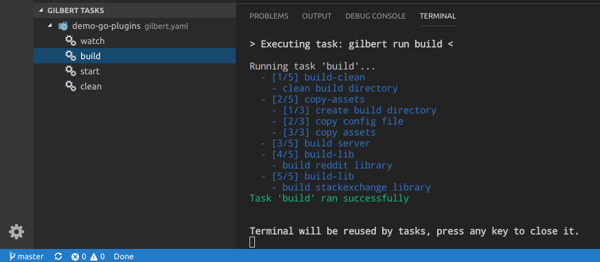

# gilbert README

This extension provides integration with [Gilbert](http://go-gilbert.github.io/gilbert) task runner.

## Features

* Display and run tasks from `gilbert.yaml` file(s)
* Multi-folder workspaces support

## Requirements

 * [Gilbert](http://go-gilbert.github.io/gilbert) v0.9+

## Release Notes

Users appreciate release notes as you update your extension.

### 0.1.0

Initial release
